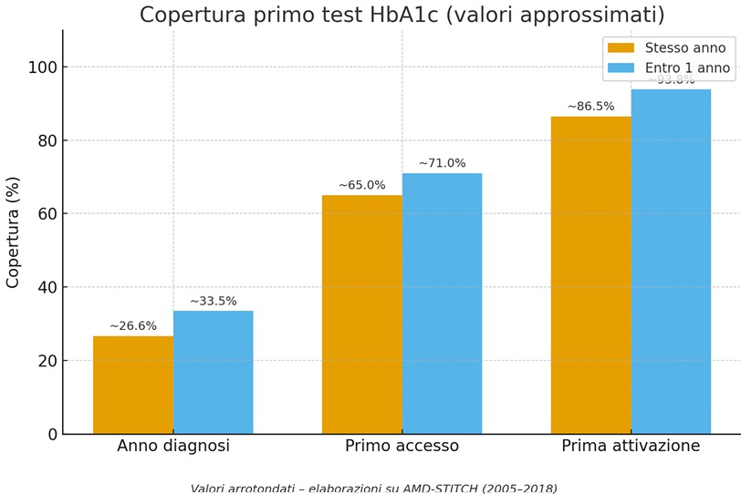
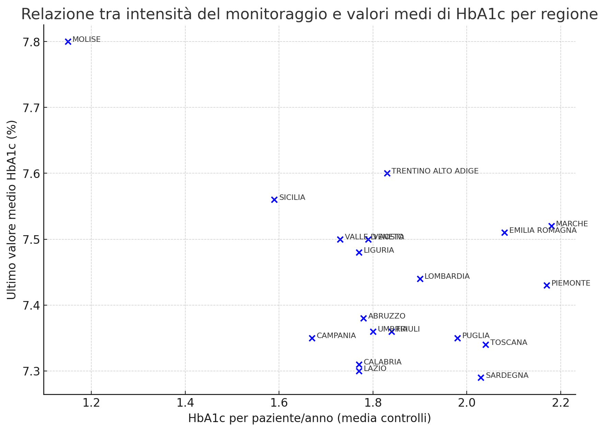
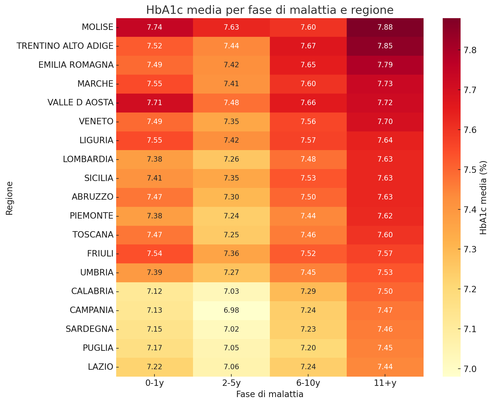
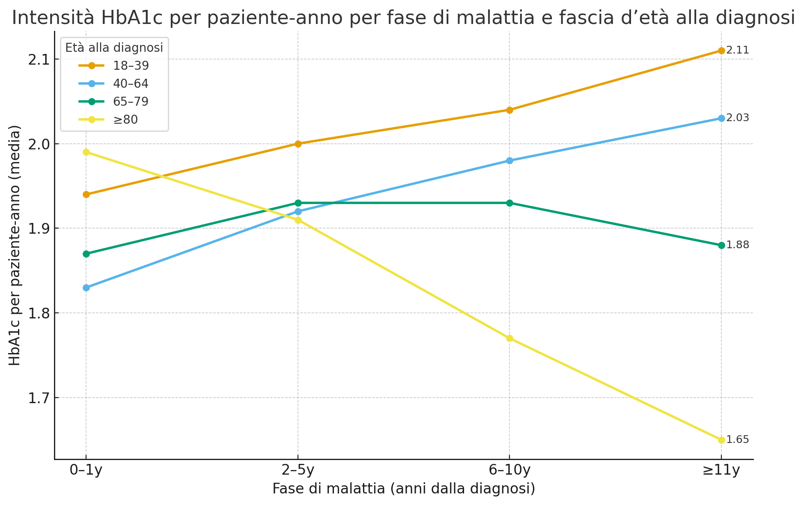
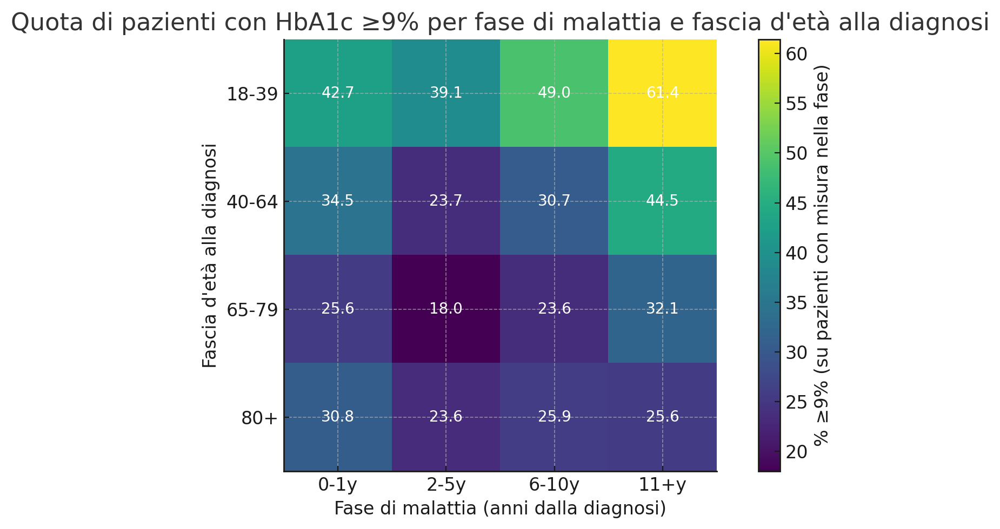

# Healthcare Data Analytics using SQL

Analysis of approximately **600,000 anonymized healthcare records** from the AMD-STITCH database using **SQL** and **PostgreSQL**.

---

# Overview

This repository contains my Bachelor's Thesis developed at Sapienza University of Rome.

Using SQL and PostgreSQL, I analyzed approximately 600,000 anonymized healthcare records from the AMD-STITCH database to investigate healthcare quality, HbA1c monitoring, disease progression, and demographic differences in patients with Type 2 Diabetes.

> **Note:** The AMD-STITCH database was developed by the STITCH Research Center (Sapienza University of Rome) in collaboration with the Associazione Medici Diabetologi (AMD). My contribution focused on data analysis using the prepared PostgreSQL database.

---
# Project Summary

This project was developed as my Bachelor's Thesis at Sapienza University of Rome using the AMD-STITCH healthcare database, one of the largest Italian repositories of anonymized clinical data for patients with Type 2 Diabetes.

The project applies advanced SQL analysis to investigate healthcare quality through real-world clinical data.

The analyses focused on HbA1c monitoring, disease progression, regional variability, demographic differences, and healthcare quality indicators.

Working with real-world clinical data required careful consideration of data quality, missing values, regional representativeness, and the ethical implications of interpreting healthcare information.

The results showed that HbA1c monitoring improves considerably after patients enter specialized diabetes care, although significant regional and demographic differences remain. The analyses also suggest that increasing the number of HbA1c tests alone does not necessarily lead to better glycemic control, highlighting the importance of follow-up quality rather than testing frequency alone.

Overall, this project demonstrates how SQL can be applied to large-scale healthcare databases to transform raw clinical data into meaningful insights supporting clinical research and healthcare decision-making.

---

# Project Objectives

The project aimed to:

- Analyze HbA1c monitoring throughout the patient care pathway.
- Evaluate healthcare quality indicators.
- Study disease progression.
- Investigate demographic and regional differences.
- Produce actionable insights through advanced SQL analysis.

---

# Dataset

The analyses were performed on the AMD-STITCH PostgreSQL database containing anonymized real-world clinical records collected from Italian diabetes centers.

### Main characteristics

- Approximately **600,000 patients**
- Data collected between **2005 and 2018**
- Clinical, demographic and laboratory information
- Fully anonymized healthcare records

---

# Analysis Performed

The project includes analyses on:

- HbA1c monitoring coverage
- Frequency of HbA1c testing
- Glycemic control
- Disease progression
- Age-related differences
- Gender differences
- Regional differences
- Marital status analysis
- Healthcare quality indicators

---

# Key Results

- Approximately **27%** of patients received an HbA1c test during the year of diagnosis.
- HbA1c monitoring increased substantially after the first specialist visit.
- Younger patients generally showed poorer glycemic control.
- Significant regional differences emerged in monitoring practices.
- Monitoring frequency alone was not always associated with better HbA1c outcomes.

---

# Visualizations

## HbA1c Test Coverage

This chart shows how HbA1c monitoring improves throughout the patient care pathway.

---

## Relationship Between Monitoring Frequency and HbA1c

Comparison between monitoring intensity and average HbA1c across Italian regions.

---

## HbA1c by Region and Disease Stage

Average HbA1c values across disease stages and Italian regions.

---

## Monitoring Frequency by Age Group

Average HbA1c monitoring intensity across disease stages for different age groups.

---

## Patients with HbA1c ≥9%

Percentage of patients with poor glycemic control across disease stages and age groups.

The complete SQL scripts used to produce these analyses are available in the `sql/` directory.

---

# Technologies

- PostgreSQL
- SQL
- pgAdmin

---

# Skills Demonstrated

- Advanced SQL
- PostgreSQL
- Relational Database Analysis
- Data Cleaning
- Exploratory Data Analysis (EDA)
- Healthcare Analytics
- Clinical Data Interpretation
- Data Visualization
- Data Reporting

---

# Dataset Availability

The AMD-STITCH database contains anonymized healthcare records and is **not publicly available**.

For privacy and licensing reasons, this repository does **not** include the original dataset. Only the SQL analyses, documentation, and visualizations created during the project are shared.

---
# Additional Documentation

For readers interested in a more detailed description of the project, the complete documentation is available below.

-  **Project Summary** – Technical overview of the project, methodology, ethical considerations, and main findings.
-  **Bachelor's Thesis (Italian)** – Complete thesis submitted to Sapienza University of Rome.

---

# Author

**Sofia Rubini**

Bachelor's Degree in Philosophy and Artificial Intelligence

Sapienza University of Rome
